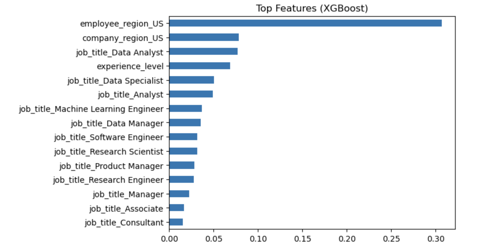

# Data Science Salary Prediction (2025)

An end-to-end machine learning project to analyze and predict data science salaries using real-world job market data. The project covers the full data science workflow, including data cleaning, exploratory analysis, feature engineering, model building, and evaluation.

---

## Project Overview

- Built a regression-based machine learning pipeline to predict **data science salaries**
- Applied **feature engineering** on job roles, company size, experience level, and geographic data
- Trained and compared multiple models including:
  - Linear Regression, Ridge, Lasso  
  - Decision Tree  
  - Random Forest  
  - XGBoost  
- Evaluated models using **RMSE, MAE, and R²**
- Identified key drivers of salary through **feature importance analysis**

---

## Dataset

- Source: Data Science Salaries Dataset (2025)
- Contains information on:
  - Job title  
  - Experience level  
  - Company size  
  - Remote ratio  
  - Employee & company location  

---

## Tech Stack

- Python  
- Pandas, NumPy  
- Scikit-learn  
- XGBoost  
- Matplotlib  

---

## Machine Learning Workflow

1. Data Cleaning & Preprocessing  
2. Exploratory Data Analysis (EDA)  
3. Feature Engineering  
4. Model Training  
5. Model Evaluation  
6. Model Comparison  
7. Feature Importance Analysis  

---

## Model Performance

| Model                | RMSE  | MAE   | R²    |
|---------------------|------|------|------|
| XGBoost             | 0.424 | 0.335 | 0.34 |
| Random Forest       | 0.425 | 0.336 | 0.34 |
| Ridge Regression    | 0.429 | 0.338 | 0.32 |
| Linear Regression   | 0.429 | 0.338 | 0.32 |
| Decision Tree       | 0.431 | 0.340 | 0.31 |
| Lasso Regression    | 0.449 | 0.356 | 0.26 |
| Baseline            | 0.522 | 0.412 | ~0.00 |

XGBoost achieved the best performance, improving prediction error by ~19% over the baseline model.

---

## Feature Importance (XGBoost)

### Key Drivers of Salary

- **Employee Region (US)** is the most dominant factor  
- **Company Region (US)** significantly impacts compensation  
- **Experience level** strongly influences salary growth  
- **Job roles** such as:
  - Data Analyst 
  - Machine Learning Engineer  
  - Research Scientist  
  contribute heavily to salary variation  

This confirms that **location + experience + role** are the primary determinants of salary.

---

## Key Insights

- **Non-linear relationships dominate salary prediction**  
  Tree-based models (Random Forest, XGBoost) outperform linear models  

- **Experience level is the strongest consistent predictor**  

- **Geographic factors significantly impact salary**  
  US-based roles tend to offer higher compensation  

- **Job roles influence salary distribution**  
  ML Engineers and Data Scientists earn more than analyst roles  

- **Feature selection matters**  
  Lasso underperformed due to aggressive feature elimination  

---

## Limitations

- Model explains ~34% of salary variance (R² ≈ 0.34)  
- Indicates missing real-world factors such as:
  - Skills and tech stack  
  - Company reputation  
  - Negotiation and compensation structure  
  - Education background  

---

## Future Improvements

- Add features like skills, education, and company data  
- Use advanced models (LightGBM, CatBoost)  
- Perform deeper hyperparameter tuning  
- Deploy model using Streamlit for real-time predictions  

---

## Highlights

- Built an end-to-end machine learning pipeline for salary prediction  
- Trained and compared multiple regression models including XGBoost and Random Forest  
- Achieved best performance with XGBoost (RMSE: 0.424), improving significantly over baseline  
- Applied cross-validation and hyperparameter tuning  
- Extracted business insights using feature importance analysis  

---

## Conclusion

This project demonstrates the effectiveness of **tree-based ensemble models** for tabular data and highlights the complexity of salary prediction. While machine learning models can capture key trends, real-world salary outcomes are influenced by additional external factors beyond the dataset.

---

## Author
Dhruv Mangal